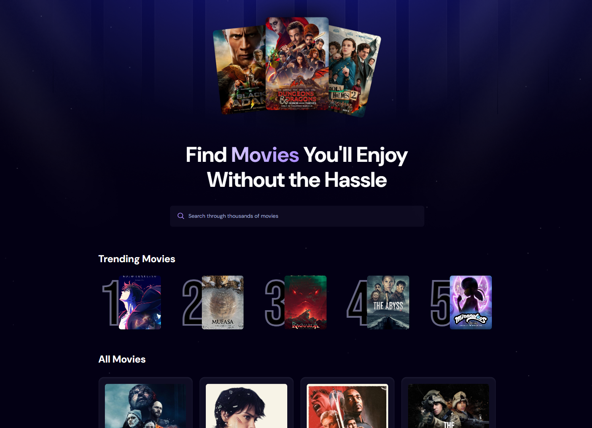

# 🎬 Movie App

[](https://reactjs.org/)
[](https://nodejs.org/)
[](https://www.mongodb.com/)

A full-stack movie discovery application that combines real-time movie data with search trend analytics.

## Table of Contents

- [Preview](#preview)
- [Features](#features)
- [Technologies](#technologies)
- [Installation](#installation)
- [Configuration](#configuration)
- [Running the Application](#running-the-application)
- [Contact](#contact)

## Preview



## Features

🎬 **Movie Grid Display**

- Responsive grid layout showing movie posters, titles, and basic info
- Fetches data from a public movie API in real-time

🔍 **Smart Search**

- Debounced search input for optimal API usage
- Instant results as you type
- Error handling for empty results

📈 **Trend Analytics**

- Tracks all movie searches in MongoDB
- Displays top 5 most searched movies in Trending section
- Real-time update of trend statistics

🚀 **Modern Stack**

- React + Vite frontend with Tailwind CSS styling
- Node.js/Express backend with MongoDB integration
- REST API for handling search tracking

## Technologies

**Frontend:**

- React
- Vite
- Tailwind CSS
- Axios

**Backend:**

- Node.js
- Express
- MongoDB (with Mongoose)
- CORS
- dotenv

**API:**

- [The Movie Database (TMDb) API](https://www.themoviedb.org/documentation/api)

## Installation

1. **Clone the repository**

   ```bash
   git clone https://github.com/PreZko/Movie-App-React-JS
   cd Movie-App-React-JS
   ```

2. **Install frontend dependencies**
   ```bash
   cd client
   npm install
   ```
3. **Install backend dependencies**
   ```bash
   cd ../server
   npm install
   ```

## Configuration

1. **Get API Key**

- Register at TMDb and get your API key

2. **Create `.env` files**

- Frontend (`client/.env`):
  ```env
  VITE_TMDB_API_KEY=your_tmdb_api_key
  VITE_MOVIE_METRIC_API_UR=your_backend_url
  ```
- Backend (`server/.env`):
  ```env
  MONGO_URI=your_mongodb_connection_string
  PORT=3000
  CORS_ORIGIN=http://localhost:5173
  ```

## Running the Application

**Start backend server:**

```bash
cd ../server
npm install
```

**Start frontend development server:**

```bash
cd ../client
npm run dev
```

The app will be available at `http://localhost:5173`

## Contact

If you'd like to connect or have any questions, feel free to reach out:

- **Email**: presiyan_bankov@gmail.com
- **LinkedIn**: [Presiyan Bankov](https://linkedin.com/in/presiyan-bankov)
- **GitHub**: [PreZko](https://github.com/prezko)
